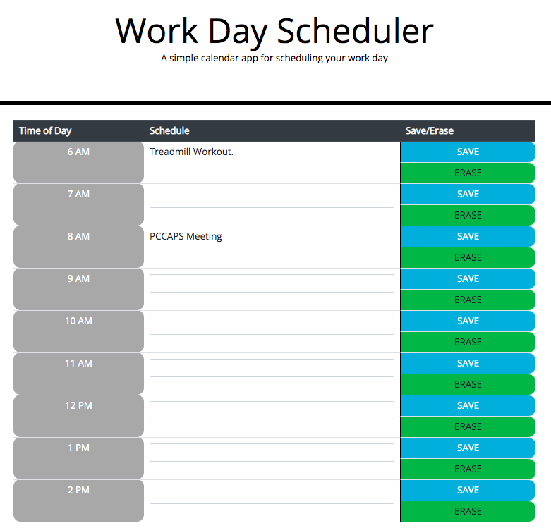

##Introduction
This is a simple website that allows one to program their day. My day generally runs from 6-3. The main focus was to learn how to use an API(in this case, moment.js). This assignment also gave me practice using local storage and Javascript.

##Technologies
Bootstrap 3 or 4
JS
moment.js

##Launch
Accessible at: https://khendersonpc.github.io/dayPlanner/.

##Examples of use
Here is screenhot of my day. It is 6:00 pm, therefore the rows are colored grey. Past rows are grey, present is red and future is green. There is a save and an erase button to the side that allows you to store or to erase your event.
At midnight, the page reloads and the schedule for the day is cleared.

